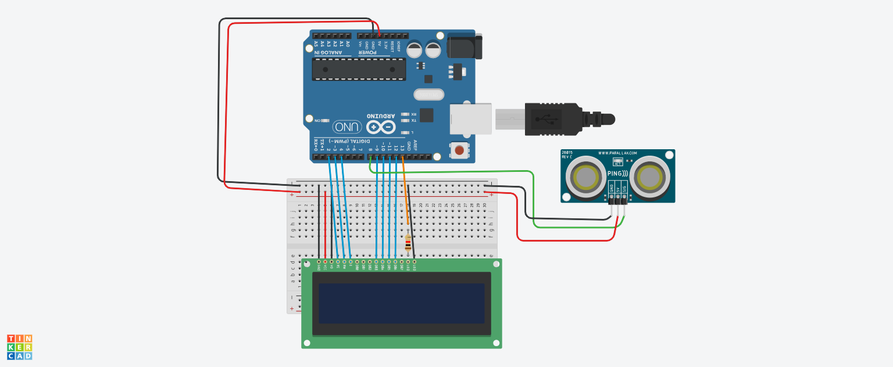

# projeto de tela LCD com sensor de distancia

este projeto foi desenvolvido dentro do tinkercard, na displina de internet das coisas
(IOT),para a criação de um prototipo com arduino que simule uma mensagem de mantenha
distancia toda vez que alguém se aproximar a menos de 1 metros do sensor 

##Componentes usados 
-1 arduino uno
-1 placa de ensaio
-1 sensor de distancia
-1 tela LCD 16x2
-14 jumpers macho-femea
-3 jumpers macho-femea
-1 resistor de 1 KOhms

## Montagem do circuito

## Explicação de codigo
 Biblioteca do LCD
#include <LiquidCrystal.h>
Criar variável do LCD
LiquidCrystal lcd(2, 3, 4, 9, 10, 11);
int ledLcd = 13;
int trigger = 7;  Pino do trigger
int echo = 8;     Pino do echo

 Método para capturar a distância
long distancia(int trigger, int echo) {
   Trigger porta de saída
  pinMode(trigger, OUTPUT);
  digitalWrite(trigger, LOW);  Desligar porta
  delay(5);  Espere 5 milissegundos
   Mandando o sinal
  digitalWrite(trigger, HIGH);
  delay(10);  Espere 10 milissegundos
  digitalWrite(trigger, LOW);  Desligar porta
  
   Echo porta de entrada
  pinMode(echo, INPUT);
  long duration = pulseIn(echo, HIGH);  Medir o tempo que o sinal leva para voltar
  long distancia = (duration / 2) * 0.0343;  Cálculo da distância em cm
  
  return distancia;
}

void setup() {
  pinMode(ledLcd, OUTPUT);  Definir ledLcd como saída
  digitalWrite(ledLcd, HIGH);  Ligar os LEDs do LCD
  lcd.begin(16, 2);  Informar que o LCD tem 16 colunas e 2 linhas
  lcd.clear();  Iniciar o LCD limpo
}

void loop() {
  long dist = distancia(trigger, echo);  Captura a distância
  
  lcd.setCursor(0, 0);  Iniciar a escrita na linha 0 coluna 0
  lcd.print("Distancia: ");
  lcd.print(dist);
  lcd.print(" cm   ");  Adiciona espaço para limpar possíveis números anteriores

  lcd.setCursor(0, 1);  Linha 1
  if (dist < 100) {
    lcd.print("Mantenha a dist");  Mensagem de aviso
  } else {
    lcd.print("Ola mundo       ");  Mensagem padrão
  }
  
  delay(1000);  Aguarde 1 segundo antes de atualizar
}

